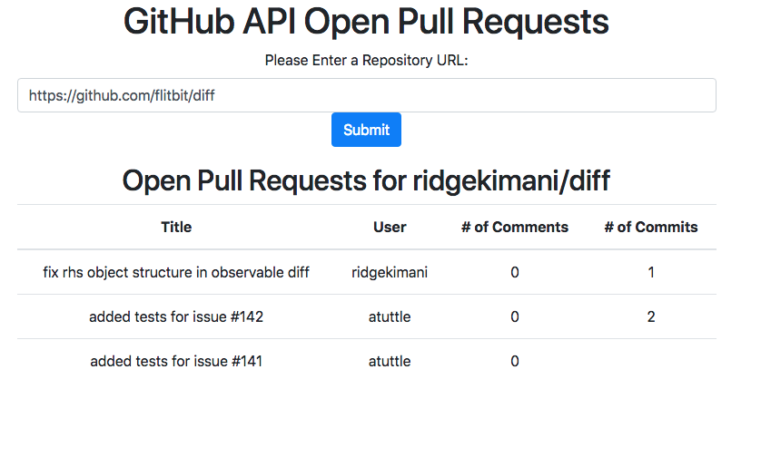

# GitHubAPI

GitHubAPI takes a GitHub repository URL, such as https://github.com/hapijs/hapi, and displays information on the open pull requests if there are any. 

Visit the deployed version of [GitHubAPI](https://thawing-beach-74807.herokuapp.com/)



## Getting Started
to install locally run this command in your terminal
```
git clone https://github.com/oserenchenko/GitHubAPI.git
```
once inside the GitHubAPI folder run 
```
npm install
```

Then, get the express sever running by typing in this command
```
node server.js
```

### Prerequisites

* [Nodejs](https://nodejs.org/)
* [Express](https://expressjs.com/)


## Built With

* HTML - website structure
* [CSS](https://css-tricks.com/) - styling
* [Bootstrap](https://getbootstrap.com/) - styling framework
* [Handlebars](https://handlebarsjs.com/) - JS templates
* [Javascript](https://www.javascript.com/) - website logic
* [jQuery](https://jquery.com/) - manipulating the DOM
* [Node.js](https://nodejs.org/en/) - JS runtime
* [Express](https://expressjs.com/) - web framework for Node.js
* [GitHub API](https://developer.github.com/v3/) - GitHub repository pull requests


## Authors

* [Olga Serenchenko](https://github.com/oserenchenko)

## License

This project is licensed under the MIT License - see the [LICENSE.md](LICENSE.md) file for details

